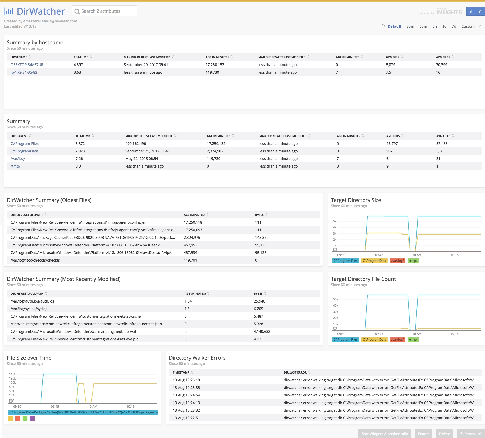

[](https://opensource.newrelic.com/oss-category/#new-relic-experimental)

# nri-dirwatcher

On-Host Integration for New Relic Infrastructure to watch files in a given directory.

Dirwatcher recursively scans the specified directories, separated by commas, and reports back the directory summary along with the oldest and newest file stats.

## Compatibility

* Windows x86/amd64
* Linux 386/amd64

## Installation

### Linux

1. Download the latest `.tar.gz` from Releases
2. Upload to host
3. Untar and enter resulting folder
4. Run `sudo ./install.sh`

### Windows

1. Download the latest `.zip` from Releases
2. Upload to host
3. Unzip and enter resulting folder
4. From Administrator command prompt, run `.\install.ps1`

## Configuration

* Edit the `newrelic-dirwatcher-config-[linux|windows].yml` file before running the install script
OR
* Modify the `newrelic-dirwatcher-config-[linux|windows].yml` file after install and restart the infrastructure agent.
  * Linux path: `/etc/newrelic-infra/integrations.d/newrelic-dirwatcher-config-linux.yml`
  * Windows path: `C:\Program Files\New Relic\newrelic-infra\integrations.d\newrelic-dirwatcher-config-windows.yml`

### Linux Configuration Example

Path: `/etc/newrelic-infra/integrations.d`
File: `newrelic-dirwatcher-config-linux.yml`

```yaml
integration_name: com.newrelic.dirwatcher

instances:
  - name: com.newrelic.dirwatcher.tmp
    command: metrics
    arguments:
      DIRWATCH: "/tmp"
      DIRWATCH_RECURSE: true
  - name: com.newrelic.dirwatcher.other
    command: metrics
    arguments:
      DIRWATCH: "/etc,/var/log"
      DIRWATCH_RECURSE: false
```

### Windows Configuration Example

Path: `C:\Program Files\New Relic\newrelic-infra\integrations.d`
File: `newrelic-dirwatcher-config-windows.yml`

```yaml
integration_name: com.newrelic.dirwatcher

instances:
  - name: com.newrelic.dirwatcher.progfiles
    command: metrics
    arguments:
      DIRWATCH: "C:\\Program Files,C:\\ProgramData"
      DIRWATCH_RECURSE: true
  - name: com.newrelic.dirwatcher.temp
    command: metrics
    arguments:
      DIRWATCH: "C:\\temp"
      DIRWATCH_RECURSE: false
```

## Usage Screenshot



## Building

1. Clone this repo
2. _If using Go v1.11 or older_, run `dep ensure` (Go v1.12+ relies on go.mod and handles the dependencies for you).
3. To build, run `./build.sh dirwatcher`

## Support

New Relic has open-sourced this project. This project is provided AS-IS WITHOUT WARRANTY OR DEDICATED SUPPORT. Issues and contributions should be reported to the project here on GitHub.

We encourage you to bring your experiences and questions to the [Explorers Hub](https://discuss.newrelic.com) where our community members collaborate on solutions and new ideas.

## Contributing

We encourage your contributions to improve nri-dirwatcher! Keep in mind when you submit your pull request, you'll need to sign the CLA via the click-through using CLA-Assistant. You only have to sign the CLA one time per project. If you have any questions, or to execute our corporate CLA, required if your contribution is on behalf of a company, please drop us an email at opensource@newrelic.com.

**A note about vulnerabilities**

As noted in our [security policy](../../security/policy), New Relic is committed to the privacy and security of our customers and their data. We believe that providing coordinated disclosure by security researchers and engaging with the security community are important means to achieve our security goals.

If you believe you have found a security vulnerability in this project or any of New Relic's products or websites, we welcome and greatly appreciate you reporting it to New Relic through [HackerOne](https://hackerone.com/newrelic).

## License

nri-dirwatcher is licensed under the [Apache 2.0](http://apache.org/licenses/LICENSE-2.0.txt) License.
