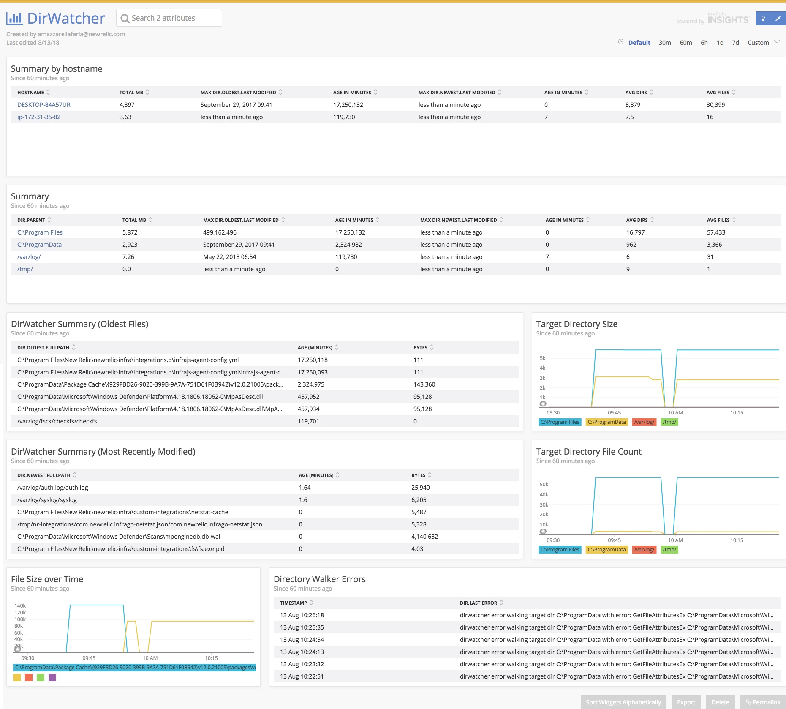

# Directory Watcher On-Host Integration

Screenshot:



## Compatibility

* Windows x86/amd64
* Linux 386/amd64

See `build.sh` and `Development` below.

## Installation

### Linux

1. Download the latest `.tar.gz` from Releases
2. Upload to host
3. Untar and enter resulting folder
4. Run `sudo ./install.sh`

### Windows

1. Download the latest `.zip` from Releases
2. Upload to host
3. Unzip and enter resulting folder
4. From Administrator command prompt, run `.\install.ps1`

## Configuration  

Edit the `*-definition-[linux|windows].yml` folder before running install
script.

Or, modify the `definition` file after install and restart infra:

**Windows:** `C:\Program Files\New Relic\custom-integrations\`

**Linux:** `/var/db/newrelic-infra/custom-integrations/`

### DirWatcher

Dirwatcher recursively scans the specified directories, separated by commas, and reports back the directory summary along with the oldest and newest file stats.

#### Command Line Example:

```
--dirwatch="\Dir1,\Dir2,\Dir3\subfolder"
```

#### Linux Configuration:

`newrelic-fs-definition-linux.yml`:

```yaml
commands:
  metrics:
    command:
      - ./fs/fs
    interval: 30
```

`newrelic-fs-config-linux.yml`:

```yaml
integration_name: com.newrelic.fs

instances:
  - name: com.newrelic.fs.tmp
    command: metrics
    arguments:
      DIRWATCH: "/tmp"
      DIRWATCH_RECURSE: true
  - name: com.newrelic.fs.other
    command: metrics
    arguments:
      DIRWATCH: "/etc,/var/log"
      DIRWATCH_RECURSE: false
```

`newrelic-fs-config-windows.yml`:

```yaml
integration_name: com.newrelic.fs

instances:
  - name: com.newrelic.fs.tmp
    command: metrics
    arguments:
      DIRWATCH: "C:\\SomeDirectoryToRecurse"
      DIRWATCH_RECURSE: true
  - name: com.newrelic.fs.other
    command: metrics
    arguments:
      DIRWATCH: "C:\\ProgramFiles,C:\\Windows"
      DIRWATCH_RECURSE: false
```

## Development

1. Clone Repo
2. Run `dep ensure`

To build:

`./build.sh dirwatcher`
